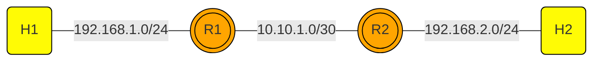
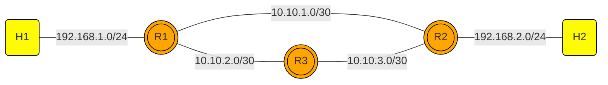

# NET101
NET101 is a repository to learn about network from traditional to programmable network using mininet environment.

## Requirement

### Option 1: VS Code DevContainer (Recommended)
Open this project in VS Code with the Dev Containers extension installed, then:
1. Click "Reopen in Container" when prompted, or
2. Use Command Palette: `Dev Containers: Reopen in Container`

The devcontainer will automatically set up the complete Mininet environment with all tools and dependencies.

### Option 2: Docker Compose
You need to install mininet on your Ubuntu Linux Server. Using this repo, you can just start the mininet container:

```bash
docker compose up -d
docker compose exec -it mininet bash
```
## Static and Dynamic Routing




